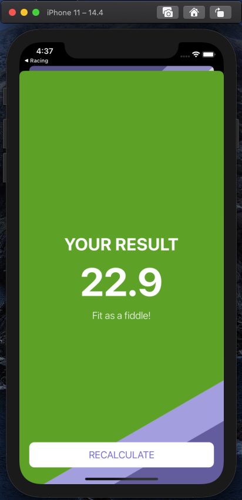
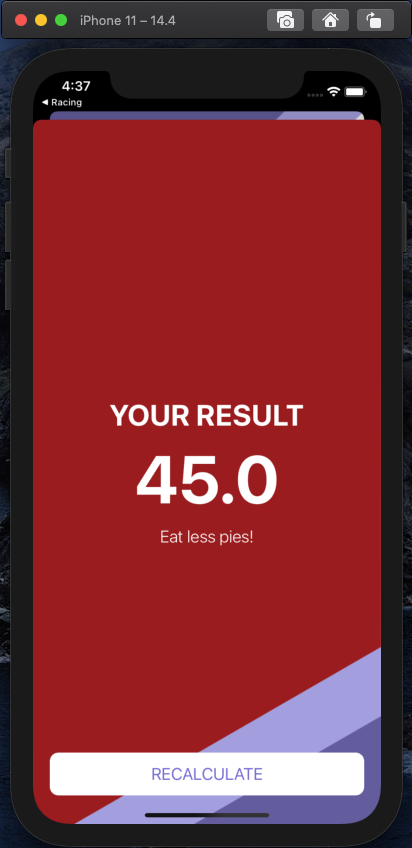

# BMICalculator
___
## Оглавление
- **[Описание](#Description)**
- **[Презентация](#Presentation)**
- **[В планах сделать](#ToDo)**

## Описание
Калькулятор ИМТ. Учебный проект.

- Проект написан на **UIKit**
- Использована стандартная архитектура **MVC**
- Верстка интерфейса **Storyboard**
- Навигация через **Segue**

___

## Презентация
### Основной экран

### Экраны результатов

___

